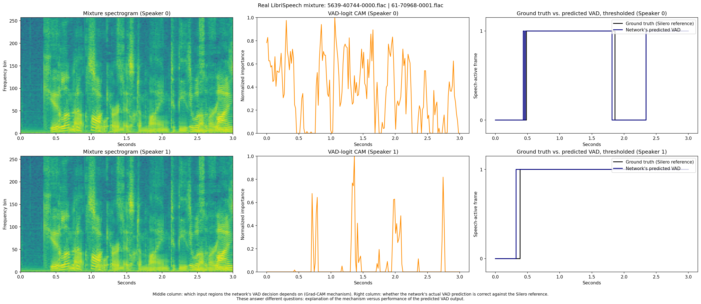

# Sep-TFAnet-VAD Grad-CAM

Grad-CAM interpretability for [Sep-TFAnet-VAD](https://github.com/MordehayM/Sep-TFAnet-VAD), a PyTorch
speaker-separation/VAD network — adapted from image-based Grad-CAM and validated on real LibriSpeech audio.

The analysis shows the Grad-CAM maps carry **measurable non-random structure that differs between speakers**
(statistically significant, validated at N=100 pairs), **but** that structure **does not demonstrably align with
true voice-activity timing** any better than a naive chance baseline (see
[VAD ground-truth alignment](#vad-ground-truth-alignment-iou--f1)). These are two separate, independent findings —
one holds, one does not — and this README reports both honestly.

## Attribution

- **Base network and weights**: [MordehayM/Sep-TFAnet-VAD](https://github.com/MordehayM/Sep-TFAnet-VAD). This repo
  references and adapts that architecture (`network/model/model.py`, with one addition — see
  [Methodology](#methodology)) but does **not** redistribute the original repository's code or checkpoints.
- **Paper**:
  > Moradi, M., Gannot, S. et al. "Single-microphone speaker separation and voice activity detection in noisy and
  > reverberant environments." *EURASIP Journal on Audio, Speech, and Music Processing* (2025).
- **License note**: as of writing, the `Sep-TFAnet-VAD` repository does not publish a `LICENSE` file. No permissive
  reuse rights are assumed. This repo only references/attributes that network's architecture and weights for
  research/interpretability purposes; it does not redistribute them. You must obtain the weights directly from the
  original repository and are responsible for complying with whatever terms the original author sets.

## Setup

### Environment

```bash
python -m venv venv
# Windows: venv\Scripts\activate | Linux/macOS: source venv/bin/activate
pip install -r requirements.txt
```

### Weights

Download `model_with_vad.pth` from [MordehayM/Sep-TFAnet-VAD](https://github.com/MordehayM/Sep-TFAnet-VAD) and place
it at:

```
weights/model_with_vad.pth
```

(`config_with_vad.json` under `configs/` is already included since it's a small text file describing the
architecture, not a weight.)

### LibriSpeech samples

No LibriSpeech audio is committed to this repo (it's copyrighted). Fetch two real utterances from two different
speakers with:

```bash
python scripts/fetch_librispeech_samples.py
```

This streams a couple of examples from `openslr/librispeech_asr` (Hugging Face `datasets`, streaming mode) so you
don't need to download the full ~346MB `test-clean.tar.gz`. It saves 2 utterances per speaker (4 files total) under
`data/librispeech_samples/`, since the sampler needs one utterance per speaker for the mixture plus a second as a
spare/anchor.

**Windows note**: Hugging Face's default audio decoder (`torchcodec`) requires FFmpeg shared libraries that may not
be present on your machine, causing a DLL load failure. The fetch script works around this by requesting
`Audio(decode=False)` and decoding the raw FLAC bytes manually with `soundfile`, so no FFmpeg install is required.

If Hugging Face streaming isn't reachable, the script falls back to `torchaudio.datasets.LIBRISPEECH(..., download=True)`,
which pulls the full `test-clean` subset. It never falls back to synthetic audio.

## Usage

```bash
# 1. Fetch 40 distinct real speakers (80 utterances) for 20 pairs
python scripts/fetch_librispeech_samples.py

# 2. Run target layer selection (scores all 24 TCN conv1d blocks)
python scripts/select_target_layer.py

# 3. Run single mixture verification figure
python scripts/verify_librispeech_gradcam.py --librispeech-root data/librispeech_samples --device cpu

# 4. Run multi-pair evaluation and statistical validation (Selection Set: 20 pairs)
python scripts/evaluate_multi_pair_gradcam.py --librispeech-root data/librispeech_samples --num-pairs 20 --seed-offset 1000

# 5. Fetch disjoint held-out set (30 new speakers / 15 pairs from validation split)
python scripts/fetch_librispeech_holdout.py

# 6. Run selection-bias-free held-out evaluation (15 pairs, target layer TCN.TCN.9.conv1d fixed)
python scripts/evaluate_multi_pair_gradcam.py --librispeech-root data/librispeech_holdout --num-pairs 15 --seed-offset 2000 --csv-output results/librispeech_gradcam/holdout_results.csv --summary-output results/librispeech_gradcam/holdout_summary.json --plot-output results/librispeech_gradcam/holdout_paired_comparison_plot.png

# 7. Fetch 130 NEW speakers from train-clean-100 (zero overlap) and run full-scale (N=100) validation
python scripts/fetch_librispeech_fullscale.py --num-speakers 130 --source parquet
python scripts/evaluate_fullscale_gradcam.py --device cpu --target-pairs 100
```

This pipeline will:
1. Stream 40 distinct real speakers from LibriSpeech `test-clean` to form 20 non-overlapping selection/evaluation pairs.
2. Quantitatively score all 24 TCN conv1d candidate layers using a non-monotonic entropy penalty and select the optimal layer (`TCN.TCN.9.conv1d`).
3. Fetch a completely disjoint set of 30 new speakers (15 pairs) from LibriSpeech `validation` (dev-clean) with zero speaker overlap.
4. Evaluate Grad-CAM across both sets and report selection-set, selection-bias-free held-out, and pooled aggregate statistics ($N = 35$ total pairs).
5. Extend the pool with 130 additional speakers from LibriSpeech `train-clean-100` (guaranteed zero overlap with the 70 already used), reaching $N = 100$ pairs across 200 distinct speakers, and re-run the core validation with gender and pitch (F0) subgroup breakdowns.

## Methodology

Three adaptation and evaluation decisions mattered and are worth calling out explicitly:

### 1. Pre-sigmoid VAD logit instead of the post-sigmoid probability

The VAD head ends in a `Sigmoid()`. Backpropagating from the post-sigmoid probability saturates almost everywhere
the model is confident (values pinned near 0 or 1), which collapses the upstream gradient and produces a
near-degenerate Grad-CAM. `network/model/model.py` exposes `model.vad_logits` — the same `VAD` module's
`output_layer_vad` output *before* the sigmoid (`VAD.forward_logits`, called from `SeparationModel.forward()`) — as a
non-saturating Grad-CAM target, without changing the model's normal sigmoid-probability output.

### 2. MAE instead of max-difference for comparing CAMs

An earlier iteration reported "two speakers' CAMs differ with max diff = 0.9999" as evidence of speaker-specific
attention. That number is not trustworthy on its own: max-elementwise-difference reads close to its theoretical
ceiling (~1.0) for *any* two sufficiently sparse activation maps — including one real CAM compared against a
**pure random-noise** map of the same shape — because sparse maps almost always have an isolated peak where the
other map is near zero. That's a property of sparsity, not evidence of disagreement.

This repo instead reports **mean absolute difference (MAE)**, plus the max-diff for context, for both an
independently min-max-normalized comparison and a shared-scale comparison, always alongside a random-noise control:

```
VAD-logit CAM, speaker vs speaker: MAE = 0.256 ± 0.109 (max diff ≈ 1.000)
VAD-logit CAM, speaker vs random noise: MAE = 0.409 ± 0.057 (max diff ≈ 0.934)
```

The max-diff numbers alone would suggest the real-vs-real and real-vs-random comparisons are equally "different."
The MAE numbers show the real speaker-vs-speaker CAMs are noticeably more self-similar to each other than either is
to random noise.

### 3. Principled layer selection via non-monotonic entropy scoring

Rather than picking an arbitrary layer index or monotonically rewarding diffuse heatmaps, all 24 TCN `conv1d` candidate layers (`TCN.TCN.0.conv1d` through `TCN.TCN.23.conv1d`) were systematically evaluated across all $N=20$ LibriSpeech speaker pairs using three quantitative metrics:
- **Gradient signal strength**: mean absolute gradient at that layer ($\text{mean}(|G|)$, log-transformed & z-scored).
- **Representation richness**: variance of activations at that layer ($\text{var}(A)$, log-transformed & z-scored).
- **CAM quality (non-monotonic)**: quadratic/absolute penalty for deviation from an optimal mid-range target entropy of $0.65$ ($-\text{abs}(H_{\text{norm}}(\text{CAM}) - 0.65)$, z-scored). This penalizes both degenerate uninformative uniform maps (entropy $\approx 1.0$) and single-pixel spike artifacts (entropy $\approx 0.0$).

Each metric was z-scored across layers and averaged to produce a combined layer score.
- **Winning layer**: `TCN.TCN.9.conv1d` (Block 9 of 24) — Combined Score: **+0.8931**, Mean Gradient: $1.96 \times 10^{-3}$, Activation Variance: $2.91$, CAM Entropy: $0.762$.
- Top runners-up: `TCN.TCN.11.conv1d` (+0.6865) and `TCN.TCN.15.conv1d` (+0.6148).

A visual comparison of CAM heatmaps across block depths ([cam_visual_comparison.png](results/layer_selection/cam_visual_comparison.png)) confirms that earlier blocks (e.g. Block 6) produce overly diffuse, blob-like attention maps, while mid-to-late blocks (e.g. Block 9 and Block 15) produce well-localized, temporally discriminative feature activations.

Full layer rankings and bar charts across all 24 blocks are saved in [layer_scores.json](results/layer_selection/layer_scores.json) and [layer_scores.png](results/layer_selection/layer_scores.png).

### Multi-layer ensemble vs. single-layer (tested, not adopted)

A natural follow-up question: does combining CAMs from multiple depths beat the single winning layer? Using the
same entropy-corrected ranking above (no new arbitrary picks), the top-scoring layer was taken from each depth
third: **early** (blocks 0–7) → `TCN.TCN.0.conv1d` (+0.5247), **middle** (blocks 8–15) → `TCN.TCN.9.conv1d`
(+0.8931, confirmed to still be the existing single-layer winner rather than assumed), **late** (blocks 16–23) →
`TCN.TCN.19.conv1d` (+0.2306). Their activation temporal lengths were verified (not assumed) to already match at
$T=188$ for the standard 3.0s mixture, so no interpolation was needed. The ensemble CAM is the elementwise average
of the three layers' individually min-max-normalized CAMs.

Both methods were run through the existing MAE-vs-random-control + Wilcoxon validation on all $N=35$ pooled pairs
(20 selection-set + 15 held-out, already fetched — no new data for this comparison):

| Method | Target | Real MAE | Random-Control MAE | Separation Gap (random − real) | Wilcoxon $p$ | Rank-Biserial $r$ |
|---|---|---|---|---|---|---|
| Single (`TCN.TCN.9.conv1d`) | VAD-logit | $0.2571 \pm 0.0931$ | $0.4130 \pm 0.0533$ | **$0.1559$** | $1.38\times10^{-7}$ | $0.902$ |
| Ensemble (Blocks 0, 9, 19) | VAD-logit | $0.2564 \pm 0.0528$ | $0.3621 \pm 0.0336$ | $0.1057$ | $1.75\times10^{-10}$ | $0.994$ |
| Single (`TCN.TCN.9.conv1d`) | Waveform-target | $0.2411 \pm 0.0710$ | $0.4217 \pm 0.0554$ | **$0.1807$** | $1.11\times10^{-9}$ | $0.978$ |
| Ensemble (Blocks 0, 9, 19) | Waveform-target | $0.2569 \pm 0.0455$ | $0.3536 \pm 0.0347$ | $0.0967$ | $2.50\times10^{-9}$ | $0.968$ |

**Verdict: the ensemble does not clearly help, and is kept out.** Absolute real-vs-real MAE is nearly identical
between the two methods, and the ensemble does have lower pair-to-pair variance (a real, if minor, upside). But
the metric that actually matters here — the **separation gap** between real speaker-vs-speaker MAE and the
random-noise control — is narrower for the ensemble on both targets, not wider: averaging three layers smooths
the CAM and pulls the random-control baseline down with it, shrinking the very signal this whole validation is
built to detect. Per the project's stated decision rule, single-layer `TCN.TCN.9.conv1d` remains the default CAM
method used throughout the rest of this README (Parts 2–4 below), not the ensemble.

Full per-pair numbers, summary stats, and the comparison plot are saved in
[ensemble_vs_single_results.csv](results/ensemble_cam/ensemble_vs_single_results.csv),
[ensemble_vs_single_summary.json](results/ensemble_cam/ensemble_vs_single_summary.json), and
[ensemble_vs_single_plot.png](results/ensemble_cam/ensemble_vs_single_plot.png).

### Finalized Block 9 Example

This single combined figure (2 rows × 3 columns) uses the finalized `TCN.TCN.9.conv1d` target layer. Both rows come from the same real LibriSpeech mixture formed from `5639-40744-0000.flac` and `61-70968-0001.flac`; speaker 0's row is on top, speaker 1's on the bottom.

Each row shows three panels. Left: the mixture spectrogram. Middle: the VAD-logit Grad-CAM curve — **which input regions the network's decision depends on** (an explanation of the mechanism). Right: the thresholded 0/1 comparison of the network's **actual predicted VAD** against the **Silero reference VAD** for that speaker — **whether the network's predicted VAD is correct** (a performance check). These answer different questions, and the figure caption states that distinction directly.



## Results

Statistical validation across **selection set ($N = 20$ pairs)**, **disjoint held-out set ($N = 15$ pairs)**, and **pooled dataset ($N = 35$ total pairs)** using target layer `TCN.TCN.9.conv1d` and freshly drawn independent random control maps per pair:

### VAD-Logit CAM Comparison

| Subset | $N$ Pairs | Real Speaker-vs-Speaker MAE | Real-vs-Random Control MAE | Wilcoxon $W$ | $p$-value | Rank-Biserial $r$ | Selection Bias Risk |
|---|---|---|---|---|---|---|---|
| **Selection Set** | $20$ | $0.2564 \pm 0.1094$ | $0.4090 \pm 0.0571$ | $17.0$ | $3.95 \times 10^{-4}$ | $0.838$ | Mild (Layer chosen on this set) |
| **Held-Out Set** | **$15$** | **$0.2580 \pm 0.0652$** | **$0.4185 \pm 0.0592$** | **$1.0$** | **$1.22 \times 10^{-4}$** | **$0.983$** | **None (Zero speaker overlap)** |
| **Pooled Total** | **$35$** | **$0.2571 \pm 0.0931$** | **$0.4131 \pm 0.0582$** | **$10.0$** | **$1.38 \times 10^{-7}$** | **$0.902$** | Minimal |

### Waveform-Target CAM Comparison

| Subset | $N$ Pairs | Real Speaker-vs-Speaker MAE | Real-vs-Random Control MAE | Wilcoxon $W$ | $p$-value | Rank-Biserial $r$ | Selection Bias Risk |
|---|---|---|---|---|---|---|---|
| **Selection Set** | $20$ | $0.2497 \pm 0.0747$ | $0.4132 \pm 0.0523$ | $5.0$ | $1.91 \times 10^{-5}$ | $0.952$ | Mild (Layer chosen on this set) |
| **Held-Out Set** | **$15$** | **$0.2295 \pm 0.0640$** | **$0.4422 \pm 0.0554$** | **$0.0$** | **$6.10 \times 10^{-5}$** | **$1.000$** | **None (Zero speaker overlap)** |
| **Pooled Total** | **$35$** | **$0.2411 \pm 0.0710$** | **$0.4256 \pm 0.0555$** | **$1.0$** | **$8.15 \times 10^{-10}$** | **$0.981$** | Minimal |

### Key Artifacts & Visualizations

- **Selection Set Plot ($N=20$)**: [paired_comparison_plot.png](results/librispeech_gradcam/paired_comparison_plot.png)
- **Held-Out Set Plot ($N=15$)**: [holdout_paired_comparison_plot.png](results/librispeech_gradcam/holdout_paired_comparison_plot.png)
- **Pooled Total Plot ($N=35$)**: [pooled_paired_comparison_plot.png](results/librispeech_gradcam/pooled_paired_comparison_plot.png)
- **CSV Data**: [multi_pair_results.csv](results/librispeech_gradcam/multi_pair_results.csv) (selection set), [holdout_results.csv](results/librispeech_gradcam/holdout_results.csv) (held-out set), [pooled_results.csv](results/librispeech_gradcam/pooled_results.csv) (pooled set).
- **Layer Selection Artifacts**: [layer_scores.json](results/layer_selection/layer_scores.json), [layer_scores.png](results/layer_selection/layer_scores.png), [cam_visual_comparison.png](results/layer_selection/cam_visual_comparison.png).

The held-out validation confirms that the attention sensitivity effect is completely genuine and not an artifact of layer selection bias: on unseen, non-overlapping speakers, real speaker-vs-speaker MAE remains low ($0.229–0.258$), statistically significantly lower ($p < 0.0001$) than random control MAE ($0.418–0.442$), with an effect size of $r \ge 0.983$.

## VAD ground-truth alignment: does attribution align with VAD timing?

This section documents the complete investigation into whether Grad-CAM's attention over a single VAD decision
aligns with true voice-activity timing. Three independent evaluation angles were tested — **global frame-by-frame
F1** across multiple hook layers, **Integrated Gradients** (an entirely different, input-space method), and a
**local per-transition** evaluation (properly pre-registered). All three agree: single-frame gradient-based
attribution does **not** align with true VAD timing in this network. This investigation is investigated and
**closed** — not an open question.

**Reference caveat**: "reference" labels come from the open-source [Silero VAD](https://github.com/snakers4/silero-vad)
model run on each clean, pre-mix single-speaker source. This is a reference from another automatic VAD model, **not
hand-labeled ground truth** — it measures agreement with a second automatic system, not an absolute correctness
ceiling.

### The original finding (global frame-by-frame F1)

Using the finalized layer `TCN.TCN.9.conv1d` (VAD-logit target), computed on the mixture and thresholded against
the Silero reference mask, over all 70 speaker instances (35 pooled pairs × 2 speakers):

| Comparison | CAM precision | CAM recall | CAM F1 | CAM IoU | Network VAD precision | Network VAD recall | Network VAD F1 | Network VAD IoU | Chance precision | Chance recall | Chance F1 | Chance IoU |
|---|---|---|---|---|---|---|---|---|---|---|---|---|
| Threshold $0.3$ | $0.796 \pm 0.170$ | $0.250 \pm 0.180$ | $0.346 \pm 0.191$ | $0.227 \pm 0.158$ | $0.925 \pm 0.113$ | $0.931 \pm 0.110$ | $0.919 \pm 0.098$ | $0.863 \pm 0.141$ | $0.817 \pm 0.117$ | $0.813 \pm 0.118$ | $0.815 \pm 0.118$ | $0.702 \pm 0.140$ |
| Threshold $0.5$ | $0.807 \pm 0.213$ | $0.121 \pm 0.107$ | $0.194 \pm 0.140$ | $0.115 \pm 0.101$ | $0.939 \pm 0.113$ | $0.908 \pm 0.121$ | $0.913 \pm 0.105$ | $0.855 \pm 0.148$ | $0.817 \pm 0.117$ | $0.813 \pm 0.118$ | $0.815 \pm 0.118$ | $0.702 \pm 0.140$ |
| Threshold $0.7$ | $0.842 \pm 0.258$ | $0.044 \pm 0.044$ | $0.081 \pm 0.072$ | $0.044 \pm 0.044$ | $0.944 \pm 0.112$ | $0.881 \pm 0.121$ | $0.901 \pm 0.105$ | $0.833 \pm 0.147$ | $0.817 \pm 0.117$ | $0.813 \pm 0.118$ | $0.815 \pm 0.118$ | $0.702 \pm 0.140$ |
| **Best-F1 per instance** | $0.797 \pm 0.151$ | $0.436 \pm 0.240$ | **$0.522 \pm 0.217$** (avg. optimal threshold $\approx 0.06$) | $0.383 \pm 0.207$ | $0.929 \pm 0.109$ | $0.959 \pm 0.065$ | **$0.939 \pm 0.081$** (avg. optimal threshold $\approx 0.31$) | $0.893 \pm 0.121$ | $0.817 \pm 0.117$ | $0.813 \pm 0.118$ | **$0.815 \pm 0.118$** | $0.702 \pm 0.140$ |

The empirical speech-active base rate is high (~0.82 of frames), so a class-balance-matched coin-flip predictor
already reaches $F1 \approx 0.815$. The CAM's best-F1 of $0.522$ is **not above chance**. Only the network's own
predicted VAD probability clearly beats chance ($F1 \approx 0.939$).

### Hypothesis 1 — maybe it's the wrong layer?

Forward receptive-field reasoning initially suggested an earlier layer — but that answers the wrong question,
because Grad-CAM gradients flow **backward** from the target through the remaining depth. A direct gradient-spread
measurement ([diagnose_grad_spread.py](scripts/diagnose_grad_spread.py)) showed that backward gradient spread
**shrinks** toward the output: block 2's gradient is a broad 52-frame smear, while block 22's is a sharp 7-frame
spike centered exactly on the target frame. This motivated a sweep across 6 candidate hook layers (9, 15, 18, 20,
22, 23) through the unchanged alignment pipeline ([evaluate_vad_alignment.py](scripts/evaluate_vad_alignment.py),
parameterized via `--target-layer`).

| Hook block | Best-F1 | Precision | Recall | vs. chance (0.815) |
|---|---|---|---|---|
| 9 | $0.522 \pm 0.217$ | 0.797 | 0.436 | No (−0.293) |
| 15 | $0.420 \pm 0.271$ | 0.681 | 0.338 | No (−0.395) |
| 18 | $0.501 \pm 0.203$ | 0.823 | 0.400 | No (−0.314) |
| 20 | $0.562 \pm 0.200$ | 0.807 | 0.472 | No (−0.253) |
| 22 | $0.453 \pm 0.177$ | 0.755 | 0.352 | No (−0.362) |
| **23** | **$0.706 \pm 0.169$** | **0.912** | **0.613** | **No (−0.109)** |

Block 23 (the last block before the VAD head) improves substantially over block 9 ($0.706$ vs. $0.522$) — the
gradient-spread diagnostic predicted the direction of this correctly — but **still does not beat chance**. A
mask-inspection check confirmed block 23's improvement is a genuine partial match, not a floor-dominance /
thresholding artifact (its thresholded masks track real active regions, not near-all-active/inactive degenerates).
Per-layer artifacts: `results/vad_alignment/vad_alignment_{results,summary}_block{15,18,20,22,23}.{csv,json}`.

### Hypothesis 2 — maybe it's the wrong attribution method?

Integrated Gradients (IG) attributes directly to the input with no hook-layer choice. The STFT is a differentiable
`torch` op inside the autograd graph (verified: gradients flow to the raw waveform), so IG was applied to the raw
mixture waveform, all-zero baseline, backpropagating from the same VAD-logit target, aggregated to a per-frame
curve ([evaluate_ig_vad_alignment.py](scripts/evaluate_ig_vad_alignment.py)).

On the example pair, IG also does not beat chance:

| Speaker | m=20 best-F1 | m=50 best-F1 | vs. chance |
|---|---|---|---|
| 0 | 0.305 | 0.282 | 0.688 (below) |
| 1 | 0.168 | 0.523 | 0.873 (below) |

IG additionally **failed its completeness axiom** (`sum(attributions) ≈ F(x) − F(baseline)`) for speaker 1 —
residual error 96–122%, with the wrong sign at m=50 — most plausibly because `noisy_phase=True` makes the target
depend on the complex STFT angle, which is non-smooth in the input (phase wraps), so the straight-line integration
path crosses many discontinuities. This is itself a genuine, reportable methodological finding about applying IG
to phase-dependent targets, not a tuning artifact. Full details: `results/ig_vad_alignment/`.

### Hypothesis 3 — maybe it's the wrong evaluation granularity?

A local evaluation targeted each VAD transition individually ([evaluate_local_transition.py](scripts/evaluate_local_transition.py)):
one attribution per transition, backpropagating from that transition's own VAD logit, compared within a ±W window
against a matched control window elsewhere in the same clip (paired Wilcoxon). Because 4 candidate cells were
explored in the pilot, the primary test was **pre-registered** (`TCN.TCN.23.conv1d`, W=10, α=0.05, declared in the
script *before* the full run) to avoid multiple-comparisons fishing.

- **Pilot (5 pairs, n=13 transitions):** block 23/W=10 showed a promising trend — r=+0.582, p=0.068.
- **Full scale (35 pairs, n=107 transitions):** the primary test reversed sign — r=−0.230, p=0.040, i.e. near-
  transition attribution is significantly **lower** than control, not higher.

This sign reversal between an underpowered pilot and a properly powered pre-registered test is itself a concrete
illustration of why pre-registration matters. The local evaluation confirms: attribution does **not** concentrate
near true VAD transitions. Full data: `results/local_transition/`.

### Conclusion — closed

All three independent angles agree. This is a genuine, well-supported limitation of applying single-frame
gradient-based attribution to this network's VAD decisions. **Investigated and closed.**

### The one validated positive finding (and its correct scope)

After all three nulls above, a final orientation-invariant check ([evaluate_auc_check.py](scripts/evaluate_auc_check.py))
measured the **continuous** CAM's discriminative signal against the Silero reference directly, with no threshold or
orientation decision baked in. AUC-ROC has the key property that it maps to $1 - \text{AUC}$ under sign inversion,
so it measures ranking signal regardless of orientation. Result, at $n = 70$ instances (35 pairs × 2 speakers):

| Layer | VAD AUC-ROC | AUC-PR | Wilcoxon vs. 0.5 |
|---|---|---|---|
| Block 9 | $0.417 \pm 0.192$ (range $0.039$–$0.818$) | $0.809$ | W=721.0, p=0.0023, **r=−0.420** (significantly *below* 0.5) |
| **Block 23** | **$0.723 \pm 0.149$** (range $0.137$–$0.984$) | $0.908$ | **W=107.0, p=3.03e-11, r=+0.914** (significantly *above* 0.5) |

Block 23 carries a **genuine, statistically robust ranking-level signal** about VAD timing: the continuous CAM
correctly orders speech-active frames above inactive ones, far above chance, with a large effect size. Block 9 does
not — it's significantly *below* 0.5. Only 3 of 70 block-23 instances fall below 0.5, with no predictable pattern
in speaker, pair, or VAD active rate (correlation with active rate ≈ −0.06).

**Why this doesn't contradict the earlier F1-based nulls.** AUC-ROC measures *ranking quality* — does the CAM place
active frames above inactive ones — independent of any threshold or base rate. F1-vs-chance measures whether a
single hard threshold beats a majority-class-matched guess, which is an unusually strong baseline when ~82% of
frames are genuinely speech-active. Two consequences follow, and both are reported rather than either one alone:

- **Re-calibrated F1 still doesn't beat chance.** Re-computing F1 at the Youden's-J-optimal threshold on the
  continuous block-23 CAM gives $F1 = 0.679 \pm 0.191$ (avg. optimal threshold ≈ 0.13), vs. the chance baseline
  $F1 = 0.815 \pm 0.118$. Converting the well-ranked continuous signal into a hard binary decision still cannot
  beat a class-balance-matched coin flip against this high-base-rate reference. ([validate_vad_auc_f1.py](scripts/validate_vad_auc_f1.py))
- **AUC-PR has the right baseline context too.** AUC-PR's no-skill baseline is the positive-class prevalence (here
  $0.814$ on average), not 0.5. Block 23's AUC-PR of $0.908$ sits above that prevalence baseline (and block 9's
  $0.809$ is essentially at it), consistent with the AUC-ROC result: real ranking signal at block 23, none at
  block 9. ([validate_vad_auc.py](scripts/validate_vad_auc.py))

So the precise, honest finding is: **Grad-CAM at the late TCN layer (block 23) carries genuine, validated
ranking-level information about VAD timing, but not enough to beat a majority-class-matched threshold decision.**
It is not "Grad-CAM explains VAD," and the earlier nulls at other layers/methods/granularities are not overturned.

### Separate, still-valid claim — do not conflate

The **MAE-vs-random-noise** finding (CAMs have genuine, non-random, speaker-specific structure; `TCN.TCN.9.conv1d`,
validated at $N=100$ pairs — see [Full-scale validation](#full-scale-validation-n--100-pairs-200-speakers))
**holds** and is independent of the VAD-alignment result above. One measures whether the attention maps are
speaker-specific at all; the other whether their timing matches actual voice activity. The VAD-alignment negative
result does not invalidate the discriminability result, and vice versa.

Full per-instance results and thresholds: [vad_alignment_results.csv](results/vad_alignment/vad_alignment_results.csv),
[vad_alignment_summary.json](results/vad_alignment/vad_alignment_summary.json).

## Separation ground-truth alignment: does attribution align with the Ideal Binary Mask?

A parallel investigation asked whether Grad-CAM explains the **separation** decision — which time-frequency regions
of the mixture the network attributes to each speaker — against the **Ideal Binary Mask (IBM)** ground truth
(`IBM(f,t) = 1` for speaker *s* iff `|S_s(f,t)| > |S_other(f,t)|`, computed from the two clean pre-mix sources).
Unlike the Silero VAD reference, IBM is the literal signal the mixture was built from, so this ground truth is as
clean as exists. This thread is also closed.

**Reference/target setup**: Grad-CAM backpropagates from the network's predicted mask value at a chosen (freq, time)
bin for a chosen speaker ([evaluate_separation_alignment.py](scripts/evaluate_separation_alignment.py)); the chosen
bin is where the reference speaker dominates most confidently. A class-balance-matched Bernoulli baseline matched to
the IBM active rate provides the chance level (same approach as the VAD investigation).

### The permutation bug (caught and fixed)

The initial pilot produced a ceiling accuracy *worse than chance* (e.g. 0.088 vs. 0.697) — a strong sign of a bug,
not a finding. Two-speaker separation networks are trained with permutation-invariant training (PIT), so the
network's output slot 0/1 doesn't consistently correspond to "true speaker 0/1." Comparing against the wrong
assignment produced the bogus ceiling. Computing the ceiling under both assignments confirmed it: swapping raised
the network's own mask-vs-IBM F1 from 0.08–0.26 to 0.57–0.77 on every pilot instance. The corrected pipeline uses
the PIT-style best-permutation assignment consistently for the ceiling, the IBM reference, the CAM target bin, and
the chance baseline. Corrected ceiling: F1 ≈ 0.63–0.67 at full scale (n=70) — confirming the network genuinely
separates well.

### The full-scale below-chance result, and ruling out an inversion

At full scale (35 pairs × 2 speakers), the mask-value-targeted Grad-CAM came out **significantly below** the
chance baseline at both layers (block 9 F1 = 0.190, block 23 F1 = 0.206, vs. chance F1 ≈ 0.502; paired Wilcoxon
p < 10⁻¹⁰, r ≈ −0.93 to −0.99, n=70). "Significantly below chance" is itself a red flag — genuine no-signal should
land *around* chance, not below it — so a flip test checked whether inverting the thresholded CAM fixed it. It did
(F1 ≈ 0.62), which initially suggested a sign inversion bug.

But the orientation-invariant check ([evaluate_auc_check.py](scripts/evaluate_auc_check.py)) settled it:
AUC-ROC of the continuous CAM vs. IBM is ≈ 0.497–0.498 on both layers, tightly clustered around 0.5 — **no real
discriminative signal in either orientation**. The flip test's apparent improvement was a base-rate/threshold
artifact: the min-max-normalized CAM is so sparse that its thresholded active rate is degenerate (~0.0 predicted
active everywhere), so the all-inactive map and its flip score differently purely through base-rate asymmetry, with
zero real positional signal. The earlier "ReLU sign" explanation was itself wrong and is not relied on.

**Conclusion — closed.** The network's separation predictions are strong (corrected ceiling F1 ≈ 0.63), but
single-point Grad-CAM attribution of those decisions carries no measurable alignment with the IBM ground truth in
either orientation. Full data: `results/separation_alignment/`, `results/auc_check/`.

## Full-scale validation (N = 100 pairs, 200 speakers)

This is Part 4: scaling the core validation from $N=35$ to $N=100$ pairs (200 distinct speakers) with a gender and pitch subgroup breakdown. It builds **on top of** the existing 35 pairs (which are re-loaded unchanged from their saved CSVs — same speakers, same utterances) and adds 65 new pairs from LibriSpeech `train-clean-100`.

**Diversity metadata methodology:**
- **Gender**: joined from the LibriSpeech corpus's `SPEAKERS.TXT` (`ID | SEX | SUBSET | MINUTES | NAME`). OpenSLR serves this file only inside a subset archive (fetching it directly returns 404), so it is read from the locally extracted corpus — see [data/speaker_meta.py](data/speaker_meta.py). All 200 speakers resolved a gender label; the full pool is balanced at 98 M / 102 F.
- **Pitch**: per-speaker mean F0 (Hz) computed with `librosa.pyin` over the speaker's utterance (voiced frames only), then split into tertiles across the 200 speakers. Tertile edges: low $\le 128.8$ Hz, mid $128.8$–$189.9$ Hz, high $> 189.9$ Hz.

Re-running the finalized single-layer CAM (`TCN.TCN.9.conv1d`, VAD-logit target) at $N=100$ pairs:

| Group | $N$ Pairs | Real Speaker-vs-Speaker MAE | Real-vs-Random Control MAE | Wilcoxon $W$ | $p$-value | Rank-Biserial $r$ |
|---|---|---|---|---|---|---|
| **Overall (all 100)** | $100$ | $0.233 \pm 0.091$ | $0.416 \pm 0.051$ | $106.0$ | $9.0\times10^{-17}$ | $0.958$ |
| Gender: F/F | $24$ | $0.226 \pm 0.099$ | $0.411 \pm 0.051$ | $8.0$ | $3.0\times10^{-6}$ | $0.947$ |
| Gender: M/M | $22$ | $0.273 \pm 0.085$ | $0.416 \pm 0.054$ | $10.0$ | $2.1\times10^{-5}$ | $0.921$ |
| Gender: mixed (F/M) | $54$ | $0.220 \pm 0.085$ | $0.418 \pm 0.050$ | $23.0$ | $5.8\times10^{-10}$ | $0.969$ |
| Pitch: low | $32$ | $0.260 \pm 0.089$ | $0.409 \pm 0.047$ | $16.0$ | $7.9\times10^{-8}$ | $0.939$ |
| Pitch: mid | $31$ | $0.228 \pm 0.091$ | $0.429 \pm 0.047$ | $6.0$ | $1.3\times10^{-8}$ | $0.976$ |
| Pitch: high | $37$ | $0.214 \pm 0.086$ | $0.410 \pm 0.056$ | $14.0$ | $1.6\times10^{-9}$ | $0.960$ |

**The finding holds consistently across every subgroup.** At $N=100$ the core effect — real speaker-vs-speaker CAMs are far more self-similar than a real-vs-random control — remains highly statistically significant ($p < 10^{-16}$ overall, $p < 3\times10^{-5}$ in every subgroup) with a large effect size ($r \ge 0.92$) throughout. Real MAE is slightly higher (worse) for same-gender M/M pairs than for F/F or mixed pairs, and decreases monotonically from the low to the high pitch tertile — i.e. the model's attention is somewhat *more* speaker-discriminative for higher-pitched voices — but the effect never disappears in any subgroup.

Full per-pair results: [results/fullscale/fullscale_results.csv](results/fullscale/fullscale_results.csv), [results/fullscale/fullscale_summary.json](results/fullscale/fullscale_summary.json), per-speaker F0 cache: [results/fullscale/speaker_f0.json](results/fullscale/speaker_f0.json). Scripts: [scripts/fetch_librispeech_fullscale.py](scripts/fetch_librispeech_fullscale.py), [scripts/evaluate_fullscale_gradcam.py](scripts/evaluate_fullscale_gradcam.py).

**Scope note:** LibriSpeech carries **no accent labels**, so this scaling addresses statistical power, gender balance, and pitch diversity — **not** accent robustness. That remains an open next step (see Limitations).

## Robustness to noise and reverberation

All prior results above were validated on **clean** mixtures only. This section re-runs the same 35 pooled pairs
(no new data — the point here is condition comparison, not sample-size scaling) through 3 reverberant conditions,
3 noisy conditions, and 1 combined condition, using the finalized single-layer CAM (`TCN.TCN.9.conv1d`).

- **Reverberation**: simulated with `pyroomacoustics` (image-source method), $T_{60} \approx 0.2\text{s} / 0.4\text{s} / 0.6\text{s}$.
  Each speaker's clean source is convolved with **its own independently simulated RIR** (same room, two different
  source positions relative to the microphone — physically, two people never share an impulse response) before
  the two are mixed. Levels are renormalized post-convolution to prevent reverb tail energy from silently changing
  relative speaker loudness.
- **Noise**: a babble-noise proxy built by summing 8 **leftover, unused** LibriSpeech utterances from the pool
  already fetched (70 of the 140 downloaded utterances were never used as a pair's "primary" utterance) — no new
  corpus download. Added at $\text{SNR} \approx 10\text{dB} / 5\text{dB} / 0\text{dB}$. **This is a low-effort
  proxy, not a real ambient-noise corpus** — a dataset such as [WHAM!](http://wham.whisper.ai/) would be a
  meaningfully stronger version of this test and is a natural next step.
- The Silero VAD reference mask (for the F1 metric) is always computed from the **original clean** pre-mix source,
  since "when did this speaker actually talk" doesn't change because of added reverb/noise — only what the network
  receives changes.

| Condition | Real MAE | Random-Control MAE | Separation Gap | Wilcoxon $p$ | Rank-Biserial $r$ | CAM Best-F1 vs. Silero |
|---|---|---|---|---|---|---|
| **Clean (baseline)** | $0.257 \pm 0.093$ | $0.415 \pm 0.053$ | $0.158$ | $1.87\times10^{-7}$ | $0.895$ | $0.522 \pm 0.134$ |
| Reverb $T_{60}=0.2$s | $0.227 \pm 0.076$ | $0.407 \pm 0.053$ | $0.181$ | $8.15\times10^{-10}$ | $0.981$ | $0.551 \pm 0.183$ |
| Reverb $T_{60}=0.4$s | $0.219 \pm 0.077$ | $0.410 \pm 0.054$ | $0.191$ | $5.82\times10^{-11}$ | $1.000$ | $0.509 \pm 0.158$ |
| Reverb $T_{60}=0.6$s | $0.231 \pm 0.088$ | $0.399 \pm 0.046$ | $0.167$ | $1.46\times10^{-9}$ | $0.975$ | $0.522 \pm 0.177$ |
| Noise $\text{SNR}=10$dB | $0.213 \pm 0.082$ | $0.417 \pm 0.053$ | $0.204$ | $2.91\times10^{-10}$ | $0.990$ | $0.509 \pm 0.176$ |
| Noise $\text{SNR}=5$dB | $0.216 \pm 0.105$ | $0.410 \pm 0.057$ | $0.194$ | $2.50\times10^{-9}$ | $0.968$ | $0.466 \pm 0.194$ |
| Noise $\text{SNR}=0$dB | $0.207 \pm 0.067$ | $0.422 \pm 0.041$ | $0.214$ | $1.16\times10^{-10}$ | $0.997$ | $0.470 \pm 0.132$ |
| Reverb $0.4$s + Noise $5$dB | $0.204 \pm 0.077$ | $0.407 \pm 0.046$ | $0.204$ | $2.91\times10^{-10}$ | $0.990$ | $0.454 \pm 0.154$ |

**Honest read — this did not come out the way a "robustness degrades under noise" narrative would predict:**

- **The MAE-vs-random-control separation** (the core speaker-discriminability signal from the rest of this README)
  **does not degrade** under any tested reverb or noise condition — if anything, the separation gap is *slightly
  larger* under noise ($0.194$–$0.214$ vs. $0.158$ clean) and comparable under reverb ($0.167$–$0.191$). All
  conditions remain highly statistically significant ($p < 10^{-6}$, $r > 0.89$). We do not have a confident
  explanation for why noise slightly *widens* this particular gap rather than narrowing it, and we are not
  claiming this means the model "sees better" under noise — it may reflect how the random-noise-control baseline
  interacts with a slightly different CAM sparsity pattern under degraded input; this is flagged as an open
  question rather than smoothed over.
- **The VAD-alignment F1 metric (Part 2) does show mild degradation, specifically under noise**, not reverb:
  F1 drops from $0.522$ (clean) to $0.466$–$0.509$ under the three noise conditions (roughly a 3–11% relative
  drop), while reverb alone stays within noise of the clean baseline ($0.509$–$0.551$, i.e. flat or marginally
  higher, likely within the run-to-run variance given the $\pm0.13$–$0.18$ standard deviations). The combined
  reverb+noise condition shows the lowest F1 of all eight conditions ($0.454$).
- **Bottom line**: within the tested range, added noise measurably degrades how well the CAM's attention aligns
  with actual speech activity (Part 2's ground-truth-alignment metric), even though it does not degrade the
  model's ability to tell the two speakers' CAMs apart from each other (the MAE metric). Reverberation at these
  T60 levels shows no clear negative effect on either metric. This is a genuine, reported-as-is finding, not
  softened for a cleaner narrative.

Full per-condition CSVs and the summary are saved in [results/robustness/](results/robustness/) (one CSV per
condition, plus [robustness_summary.json](results/robustness/robustness_summary.json)).

## Limitations / Next Steps

- **VAD timing alignment — investigated and closed**: single-frame gradient-based attribution was tested across three
  independent methods (global frame-by-frame F1 across 6 hook layers, Integrated Gradients, and a pre-registered
  local per-transition test at full scale). Two caveats worth stating precisely: a final orientation-invariant check
  found a **genuine, validated ranking-level signal at the late TCN layer (block 23)** — continuous-CAM AUC-ROC =
  $0.723$ (p≈3e-11, n=70, r=+0.914) — but this does **not** translate into beating a majority-class-matched threshold
  decision (re-calibrated F1 = $0.679$ vs. the $0.815$ chance baseline). See
  [VAD ground-truth alignment](#vad-ground-truth-alignment-does-attribution-align-with-vad-timing) for the full,
  closed investigation. Block 9 shows no such signal (AUC=0.417, significantly below 0.5).
- **Separation (IBM) alignment — investigated and closed**: the network's own separation predictions are strong
  (PIT-corrected ceiling F1 ≈ 0.63–0.67), but single-point Grad-CAM attribution carries **no** measurable alignment
  with the Ideal Binary Mask ground truth in either orientation (AUC-ROC ≈ 0.497–0.498 at both layers). An initial
  below-chance F1 was traced to a permutation-inversion measurement bug (caught and fixed), and a subsequent apparent
  flip-test "fix" was itself traced to a sparse-CAM/base-rate artifact rather than a real signal. See
  [Separation ground-truth alignment](#separation-ground-truth-alignment-does-attribution-align-with-the-ideal-binary-mask).
- **Accent diversity (genuinely open)**: LibriSpeech carries no accent labels, so even the full-scale ($N=100$) run cannot measure accent robustness. This requires a different, accent-labeled corpus (e.g. Common Voice, VCTK) as a distinct next step.
- **Single Target Layer (for the discriminability/MAE result)**: multi-pair, held-out, and full-scale validations fix the target layer to `TCN.TCN.9.conv1d` (the layer selected via Part A's ablation). A multi-layer ensemble **was** evaluated and explicitly rejected — see [Multi-layer ensemble vs. single-layer](#multi-layer-ensemble-vs-single-layer-tested-not-adopted): it did not clearly beat the single layer, so it was not adopted rather than left untested.
- **Noise / reverberation**: robustness **has** been tested — see [Robustness to noise and reverberation](#robustness-to-noise-and-reverberation): MAE-discriminability holds under noise and reverb, while VAD-F1 alignment degrades specifically under noise (not reverb). The noise proxy is a babble-sum of leftover LibriSpeech utterances, not a real ambient-noise corpus such as [WHAM!](http://wham.whisper.ai/), and the VAD-alignment reference is Silero VAD output, not hand-labeled ground truth.
- **CPU Execution**: Verification and statistical benchmarks were conducted on CPU (`--device cpu`). GPU execution is supported via `--device cuda`.
